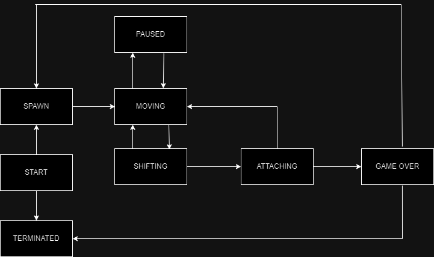

# BRICKGAME


## Controls

Start game <kbd>Enter</kbd>

Exit game <kbd>Q</kbd>

Rotate <kbd>&#8592;</kbd>

Move left <kbd>&#8592;</kbd>

Move right <kbd>&#8594;</kbd>

Move down <kbd>&#8595;</kbd>

Pause <kbd>P</kbd>
    
## Build
```sh
    make install && tetris-1.0/tetris.exe
```


## FSM
